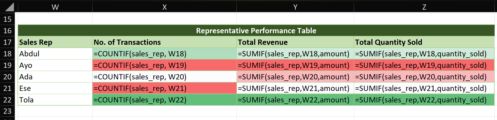
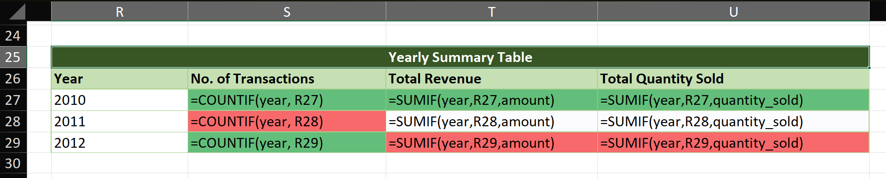
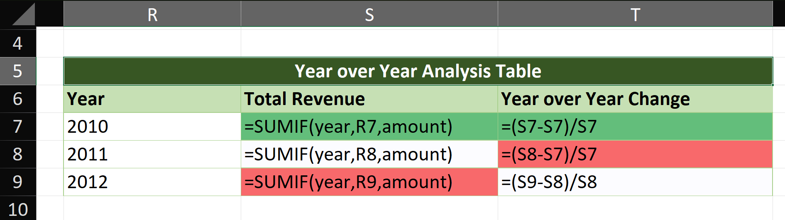

# Sales Performance Analysis - Yearly Report

## 1. Executive Summary

**Are sales increasing, decreasing, or stable?**  

- Sales are **decreasing**. Total revenue fell from $104,720 in 2010 → $83,600 in 2011 → $80,960 in 2012. 

**Overall business health:**  

- The business is **weakening**. The company recorded 2 consecutive years of revenue decline, with a total drop of $23,760 from 2010 to 2012 and no sign of recovery by the end of 2012.

---

## 2. Visual Evidence

### Representative Performance Table

- *Screenshot taken with `Ctrl + ~` to display all formulas*  
- 

### Yearly Summary Table

- *Screenshot taken with `Ctrl + ~` to display all formulas*
- 

### Additional Analysis: Year-over-Year Change

- *Screenshot taken with `Ctrl + ~` to display all formulas*
- 

---

## 3. Business Recommendations

**Which Sales Rep has the highest transaction count but not the highest revenue?**

- **None**. Tola closed the most deals — 7 transactions — and also brought in the most money at $82,720 total. So the rep with the highest transaction count \*is\* also the highest earner.

**What does this suggest about their sales behavior? Trend Analysis**

- Tola is a top performer on both volume and value — closing the most transactions. In contrast, Ayo and Ese has the fewest deals (3), suggesting a strategy focused on fewer, high-ticket clients.

**Based on yearly performance:**
**Should the company hire more staff in 2013 or reduce?**

- **The company should reduce or shouldn't hire staffs at all in 2013.**

**Explain your reasoning**

- **1. The market is shrinking**: The company sold $23,760 less in 2012 than 2010. Hiring more salespeople into a shrinking market just means more people fighting over fewer deals.

- **2. No sign of a turnaround**: 2012 was worse than 2011. If sales were recovering, we would see 2012 bounce back up. It didn’t.

- **3. Fix efficiency first**: Before adding headcount and cost, the company should figure out why everyone except Tola is struggling with volume. Train the team on Tola’s approach, don’t just add more people doing the same thing.

